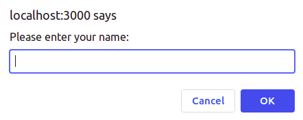
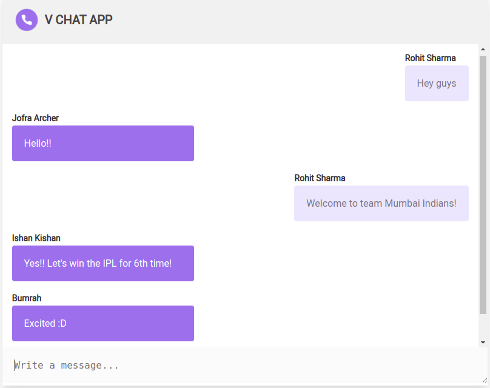

# VChat_nodejs
Real time chat application using nodejs and socket.io

Dependencies:
+ Express
+ Socket.io

Socket.io used for web socket connections.
Messages can be sent and received from connected browsers

